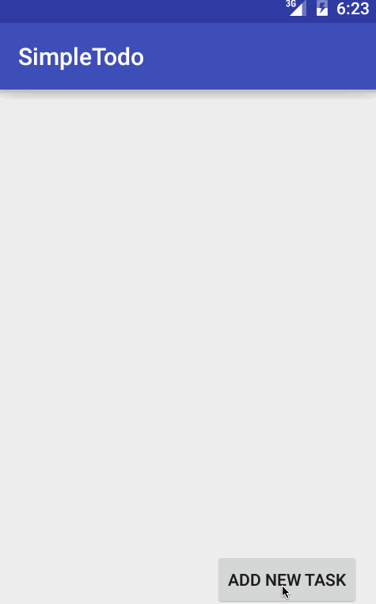

Simple todo list application for Codepath Android bootcamp pre-work.

Completed features:
 * Add and remove items
 * Edit existing items
 * Persist todo items

Updated features:
 * Use custom adapter for todo item list.
 * Use SQLite to persist data.
 * Add support to specify the due date of a task.
 * Add support to makr a task as high priority.

GIF created with [LiceCap](http://www.cockos.com/licecap/).
